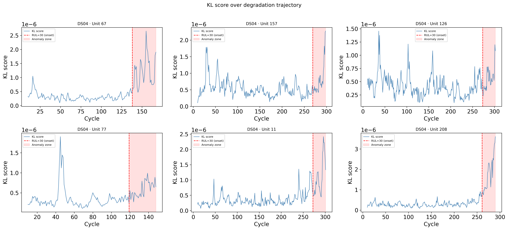
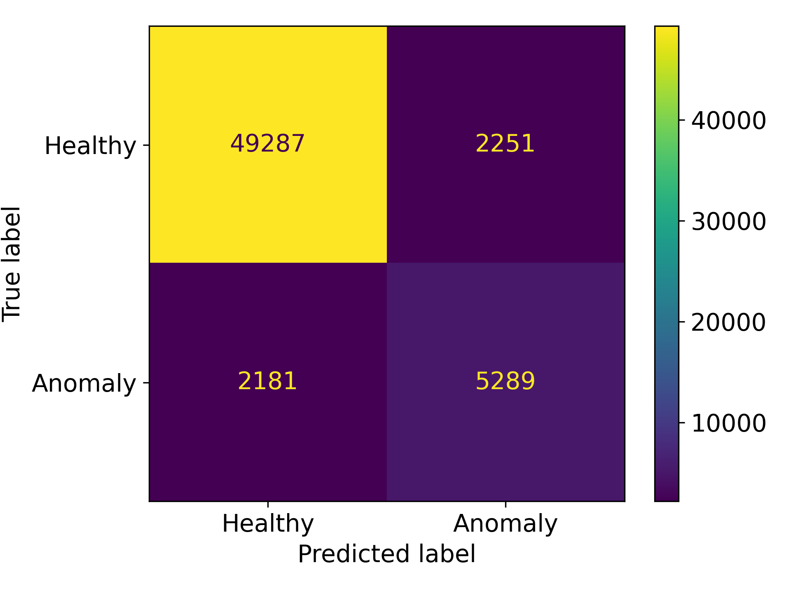

# Jet Engine (CMAPSS) Anomaly Detection

This project aims to apply Variational Autoencoder (VAE) to anomaly detection of jet engine dataset CMAPSS provided by NASA.
CMAPSS contains gradual degradation cycles of engine sensors which makes the problem challenging, since there are no specific anomalous points.

By leveraging the abilities of VAEs, reconstruction and latent mapping, we explore the application of anomaly detection in gradual but casual jet engine degradation settings.

## Getting Started

In order to run the code, run the following for installing the prerequisites.

```bash
conda create -n <env-name> python==3.12.4
conda activate <env-name>
pip install -r requirements.txt
```

## Key Concept

$$
\mathcal{L}(\theta, \phi; x) = \mathbb{E}_{q_\phi(z|x)}[\log p_\theta(x|z)] - \beta D_\text{KL}(q_\phi(z|x) || p(z))
$$

The above shows the objective function of the VAE.
The encoder and decoder are trained jointly via the objective loss function, negative Evidence Lower Bound (ELBO).

## Performance Overview


KL score differences between healthy and anomaly samples within a full degradation trajectory.


Confusion matrix, with a F1 score of 0.705, precision of 0.701, and recall of 0.708.
